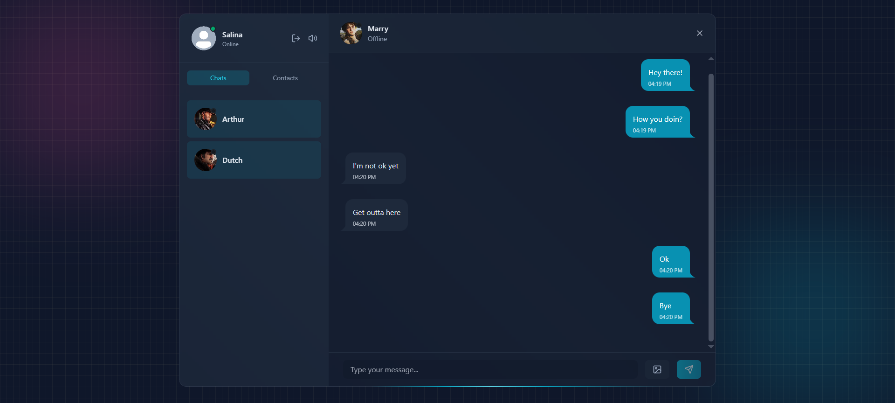

# 💬 Chatify – Real-Time Chat App  

## 📖 Description  
A modern chat application with **real-time messaging**, image sharing, and user customization.  
Includes **typing indicators**, profile selection, and **email notifications** via Resend API (The last option is only for me, because of free plan).  

## 🔗 Demo  
[Live Demo](#) | [GitHub](#)  

  

## ⚡ Installation  
```bash
git clone https://github.com/salartalaa/chatify.git
cd frontend
npm install
cd backend
npm install
```

## 📌 Usage  
1. Put your `envs` in the backend folder
2. Run the project:  
```bash
npm run dev
npm run dev -> run this command in both frontend and backend folders
```  

## ✨ Features  
- ✅ Real-time messaging with Socket.IO  
- ✅ Image sharing  
- ✅ Typing indicators  
- ✅ Email notifications (Resend API)  
- ✅ Customizable user profiles  
- ✅ Responsive design with DaisyUI  

## 🛠️ Technologies  
- React ⚛️  
- Socket.IO ⚡  
- Resend API 📧  
- DaisyUI 🎨  
